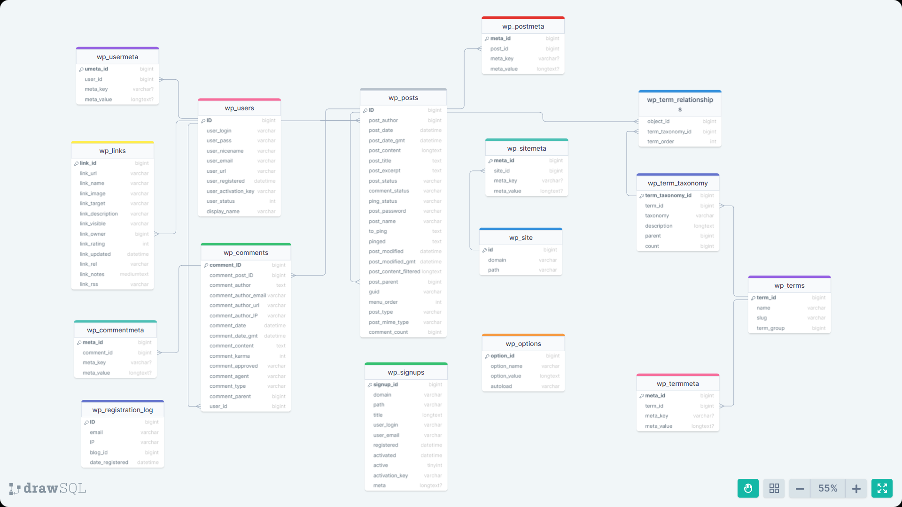
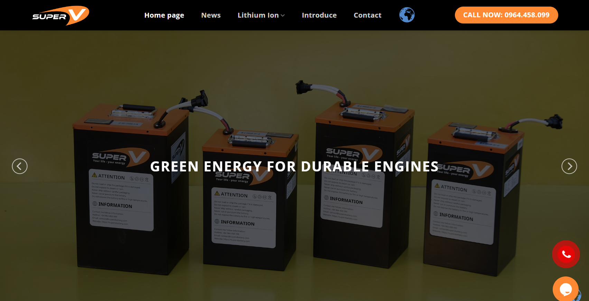

### Internship Report 🎓
**E-commerce website on the open source platform CMS Wordpress**

### Description
The project focuses on information management to effectively introduce the company and its products to users. By integrating advanced SEO strategies, this project not only improves brand recognition but also helps new products quickly reach the target market effectively.

### Technologies Used 
- Programming language: **PHP**
- Database: **MySQL**
- CMS: **WordPress**

### SQL Diagram

### Website interface

### Copyright and Security
- Data and source code are owned by [TAY HA INVESTMENT TRADING CO., LTD](https://tayha.net/)
- The internship report is based on the Super V Battery website development project. To ensure confidentiality and copyright, please refer to the website at: https://supervbattery.com/
- Note: I personally participated in the research and development work during certain stages of the project, by the time you read this note there may have been some changes that are not the same as previously described, this depends on the purpose of the owner unit.
